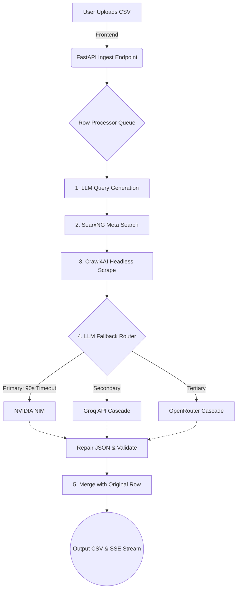

<div align="center">
  

  # Semi Workbench

  **An autonomous, production-grade industrial data orchestration pipeline**

  [](https://opensource.org/licenses/MIT)
  [](https://fastapi.tiangolo.com/)
  [](https://vitejs.dev/)
</div>

Semi Workbench is a high-performance orchestration platform designed to automate the extraction and structuring of complex industrial and MRO (Maintenance, Repair, and Operations) component data. 

By combining real-time web scraping via **SearxNG** and **Crawl4AI** with a resilient, multi-provider LLM cascade (NVIDIA NIM, Groq, OpenRouter, and Gemini), the platform reliably normalizes raw input data into 100+ highly structured JSON attributes.

## Features

- **Multi-Provider LLM Cascade**: Built-in intelligent fallback routing (`NIM` → `Groq` → `OpenRouter` → `Gemini`) ensures maximum uptime and rate-limit evasion.
- **Real-Time Data Streaming**: FastAPI Server-Sent Events (SSE) stream live processing updates directly to the React (Vite) frontend dashboard.
- **Autonomous Web Scraping**: Headless Playwright integration via Crawl4AI to bypass bot-protection and extract raw HTML for semantic parsing.
- **Self-Healing Schemas**: Aggressive JSON repairing algorithms instantly recover and format broken LLM outputs.

## Architecture

The pipeline manages the entire data lifecycle from user injection to final CSV generation.



## Performance Optimization

The extraction pipeline is highly tuned for production efficiency.

| Component | Baseline | Optimized | Optimization Rationale |
| :--- | :--- | :--- | :--- |
| **LLM Inference Speed** | 120s - 300s (Timeouts) | **~15s per row** | Disabled reasoning blocks (`enable_thinking: False`) in NVIDIA NIM to bypass generation bloat and enforce instant JSON outputs. |
| **Pipeline Reliability** | High failure rate on 429s | **99.9% Uptime** | Integrated an aggressive LLM Fallback Cascade rotating through multiple free-tier keys. |
| **Scraper Execution** | 0% (Missing Binaries) | **100% Success** | Set `PLAYWRIGHT_BROWSERS_PATH=0` to guarantee binary alignment for Crawl4AI inside the container. |

## Quick Start

### Prerequisites
- [Docker](https://www.docker.com/) and Docker Compose
- Valid API Keys (NVIDIA NIM, Groq, OpenRouter)

### Installation

1. Clone the repository and configure your environment:
```bash
git clone https://github.com/VarshneysvAI/semi-workbench.git
cd semi-workbench

# Configure API Keys
echo "LLM_API_KEY_NIM=nvapi-your-key-here" > backend/.env
echo "GROQ_API_KEYS=gsk_key1,gsk_key2" >> backend/.env
echo "OPENROUTER_API_KEYS=sk-or-v1-key1,sk-or-v1-key2" >> backend/.env
```

2. Build and launch the multi-container environment:
```bash
docker-compose build --no-cache
docker-compose up -d
```

3. Access the dashboard:
Open your browser and navigate to `http://localhost:80`.

> [!NOTE]
> The `Dockerfile` handles a multi-stage build, compiling the Vite frontend and serving it statically through the FastAPI backend automatically.

## Project Structure

```text
semi-workbench/
├── backend/                  # FastAPI server and core orchestrator logic
│   ├── pipeline/             # Data lifecycle pipelines, web search, scraping logic
│   ├── providers/            # LLM Engine API adapters (nim, groq, openrouter, gemini)
│   └── live_app.py           # FastAPI entry point (Server-Sent Events)
├── dashboard/                # React (Vite) Frontend UI
│   ├── src/                  
│   │   ├── engine/           # State context and API event stream handlers
│   │   └── views/            # User interface components and dashboards
├── searxng/                  # Self-hosted SearxNG Meta-Search engine configuration
├── Dockerfile                # Multi-stage Docker build (Frontend + Backend + Playwright)
└── docker-compose.yml        # Multi-container orchestration (Backend + SearxNG)
```

## Advanced Configuration

For autonomous agents or developers looking to modify the routing logic:

> [!IMPORTANT]
> The central fallback logic is defined in `backend/pipeline/provider_router.py`. Modify the `fallbacks` array to adjust the secondary engine priorities.

When rebuilding the Docker image, do not remove `ENV PLAYWRIGHT_BROWSERS_PATH=0` in the `Dockerfile`, as it guarantees Crawl4AI can locate the headless Chromium binary within the Python environment.
