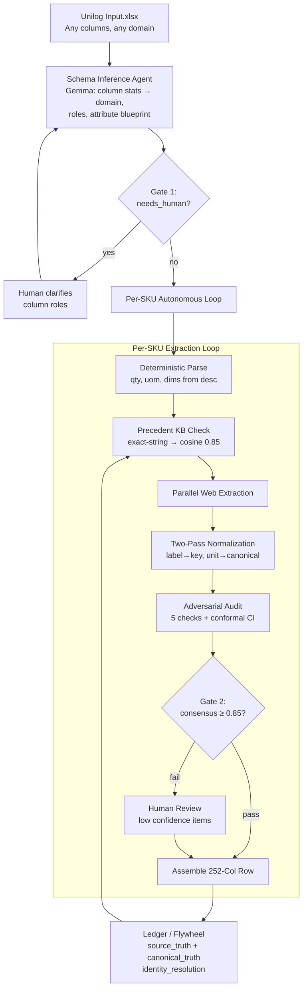

<div align="center">

# SEMI — Self-Evolving Manufacturer Intelligence


**UniHack 2026 · AI-Powered Product Intelligence for Industrial Commerce**

*Given only `(manufacturer, part_number)`, SEMI autonomously discovers manufacturer sources, extracts multi-format evidence, adversarially audits every value, and emits schema-bound output — or refuses with `INSUFFICIENT_EVIDENCE` rather than guessing.*

[](LICENSE)
[](https://www.python.org/downloads/release/python-3130/)
[](https://react.dev/)
[](https://fastapi.tiangolo.com/)
[](https://langchain-ai.github.io/langgraph/)
[](https://github.com/unclecode/crawl4ai)
[](#tests)

</div>

---

## 🎯 The Problem

Industrial manufacturers manage vast product information across websites, catalogs, technical documents, and digital assets. Transforming this fragmented data into accurate, structured, commerce-ready product intelligence is complex and time-consuming.

**UniHack 2026 Challenge**: Build an AI-powered solution that automates creation, enrichment, and validation of product intelligence **from minimal input** — just `(manufacturer, part_number)` plus a short description.

**Expected Outcomes** (official rubric):
1. Structured product intelligence from limited inputs
2. Improved product data quality & consistency
3. **Validated & enriched information with traceable outputs**
4. Scale efficiently across large product catalogs

---

## 🧠 What SEMI Is

**SEMI = Self-Evolving Manufacturer Intelligence**

```
┌─────────────────────────────────────────────────────────────────┐
│  INPUT:  Messy Excel (any columns, any count, any domain)      │
│         ~1000 rows × 6-20 columns, placeholder brands, garbage  │
└──────────────────────────┬──────────────────────────────────────┘
                           │
                           ▼
        ┌────────────────────────────────────────────┐
        │  AUTONOMOUS EXTRACTION LOOP (per SKU)      │
        │  ┌──────────────────────────────────────┐  │
        │  │ 1. DETERMINISTIC PARSE               │  │  $0, 100% confidence
        │  │    Regex/number parse from desc      │  │  qty, uom, dimensions
        │  ├──────────────────────────────────────┤  │
        │  │ 2. PRECEDENT CHECK (KB)              │  │  Exact-string → cosine 0.85
        │  │    Ledger lookup: same mfr+specs     │  │  Skip re-scraping
        │  ├──────────────────────────────────────┤  │
        │  │ 3. PARALLEL WEB EXTRACTION           │  │  Source authority ranked
        │  │    🌐 HTML  → Crawl4AI deep crawl    │  │  1.0 spec sheet
        │  │    📄 PDF   → pdf-reader-mcp (Citra) │  │  0.9 manual
        │  │    🎬 YT    → agent-reach transcript │  │  0.7 page
        │  │    🚫 Marketplace blocked            │  │  0.5 video
        │  ├──────────────────────────────────────┤  │
        │  │ 4. TWO-PASS NORMALIZATION            │  │  LLM separates extract↔norm
        │  │    Pass A: label → canonical key     │  │  Synonym dict per domain
        │  │    Pass B: unit → canonical unit     │  │  Precedence resolution
        │  ├──────────────────────────────────────┤  │
        │  │ 5. ADVERSARIAL AUDIT (5 checks)      │  │  Consensus ≥ 0.85 or REJECT
        │  │    Physical rules, contradictions,   │  │  Split-conformal 95% CI
        │  │    compositional curves, disproof,   │  │
        │  │    conformal CI                      │  │
        │  └──────────────────────────────────────┘  │
        └──────────────────────────┬─────────────────┘
                                   │
                    ┌──────────────┴──────────────┐
                    ▼                             ▼
            CONSENSUS ≥ 0.85              CONSENSUS < 0.85
                    │                             │
                    ▼                             ▼
         ┌─────────────────────┐       ┌─────────────────────┐
         │ ASSEMBLE 252-COL    │       │ HUMAN GATE 2        │
         │ ROW:                │       │ Shows: attribute,   │
         │ • 47 attr triplets  │       │ value, source_url,  │
         │ • 5 descriptions    │       │ evidence, WHY low,  │
         │ • taxonomy, images  │       │ WHERE found         │
         │ • MFR URL + 5 refs  │       │ Human corrects/     │
         │ • provenance chain  │       │ approves → ledger   │
         └─────────────────────┘       └─────────────────────┘
                    │                             │
                    └──────────────┬──────────────┘
                                   ▼
                    ┌─────────────────────────────┐
                    │ LEDGER / FLYWHEEL           │
                    │ Source-level truth +        │
                    │ Canonical truth +           │
                    │ Identity resolution +       │
                    │ changed_outcome counter     │
                    └─────────────────────────────┘
```

---

## 🏗️ Architecture — Complete Vision

### High-Level Data Flow



### Extraction Sources — Nothing Left Behind

| Source | Tool | What It Finds | Authority |
|--------|------|---------------|-----------|
| **Manufacturer HTML** | Crawl4AI deep crawl | Spec pages, datasheets, variant tables, hidden directory pages | 1.0 (spec sheet) |
| **PDF Catalogs** | pdf-reader-mcp (Citra) | Tables with geometry, OCR for scans, page-level citations, image crops | 0.9 (manual) |
| **YouTube Videos** | agent-reach transcript | Narrated specs, installation dims, certifications shown on screen | 0.5 (video) |
| **DOCX Manuals** | Firecrawl `/parse` | Structured extraction from Word specs | 0.7 (page) |
| **Precedent KB** | SQLite + embeddings | Prior human resolutions, cached extractions | 1.0 (verified) |

**Marketplaces (Amazon/eBay/Target) = HARD BLOCKED** — never used as sources.

---

## ⚙️ How It Works — The Autonomous Loop

### Phase 0: Schema Inference (Once per File)
```
Input: 1000 rows × N columns (messy)
Action: Gemma reads column stats (types, nulls, uniques, placeholder %, samples)
Output: SchemaPlan
  • domain: "power_tool_accessories"
  • product_kind: "sanding_belts"
  • column_roles: {sku, description, manufacturer, brand_candidate, ignore}
  • attribute_blueprint: [{name: "grit", type: "enum", source_hint: "desc regex"},
                          {name: "width", type: "quantity_uom", uom_candidates: ["in", "mm"]},
                          ...]
  • needs_human: true/false
  • human_questions: ["Which column is the real MPN?"]
```
**Gate 1**: If `needs_human` → pause, show ambiguous columns to human → human answers → re-run.

### Phase 1: Deterministic Parse (Per SKU, $0)
- Regex patterns for: quantities (`6pc`, `pack of 10`), dimensions (`1/2"x18"`, `12.7mm`), voltages (`120V`), simple enums
- Output: `CitedValue` objects with `confidence=1.0`, `extractor="deterministic"`

### Phase 2: Precedent Check (KB Hit)
- Exact-string match on `(manufacturer, normalized_specs)` → if hit, reuse cached `CitedValue`
- Later: cosine ≥ 0.85 with BGE-M3 embeddings for fuzzy match
- Output: `CitedValue` with `extractor="kb_hit"`

### Phase 3: Parallel Web Extraction (KB Miss)
**All three fire simultaneously:**

| Extractor | Input | Output |
|-----------|-------|--------|
| `Crawl4AI` | `site:manufacturer.com "MPN"` + deep crawl | Raw attribute batches from HTML |
| `pdf-reader-mcp` | Catalogue/spec sheet URLs | Tables + OCR + page citations |
| `agent-reach youtube.transcript` | Manufacturer channel videos | Specs from narration |

Each returns: `[{attribute, value, unit, confidence, source_url, evidence_snippet, extractor}]`

### Phase 4: Two-Pass Normalization (The Key Innovation)
**Pass A — Label → Canonical Key**
```
Input: [{"label": "Overall Width", "value": "23.5", "unit": "in"},
        {"label": "Total Width", "value": "59.7", "unit": "cm"},
        {"label": "Width (overall)", "value": "23 1/2", "unit": "in"}]

LLM Prompt: "Map each label to canonical key using domain synonym dict.
             Output: [{canonical_key, raw_label, value, unit, source_url}]"

Output: [{"canonical_key": "overall_width_in", "raw_label": "Overall Width", ...},
         {"canonical_key": "overall_width_in", "raw_label": "Total Width", ...},
         {"canonical_key": "overall_width_in", "raw_label": "Width (overall)", ...}]
```

**Pass B — Unit → Canonical Unit + Conflict Resolution**
```
Input: Pass A output (multiple sources per canonical_key)

LLM Prompt: "Convert all values to canonical storage unit (width→in, weight→lb, temp→C).
             Resolve conflicts via precedence:
             1. Manufacturer spec sheet
             2. Manufacturer HTML page
             3. Manual
             4. Distributor sheet
             5. Third-party (if verified)
             Output: [{canonical_key, canonical_value, canonical_unit, confidence, source_url}]"
```

### Phase 5: Adversarial Audit (5 Checks + Conformal CI)
| Check | Method | Output |
|-------|--------|--------|
| Physical Rules | Deterministic rules (width>0, PVC→pressure≤150psi) | pass/fail + details |
| Cross-Source Contradiction | Compare normalized values across sources | pass/fail + conflicting sources |
| Compositional Curve | Physics-based curve fit (e.g., belt tension vs width) | pass/fail + deviation |
| Disproof Search | Active query: "find evidence this value is wrong" | pass/fail + disproof URL |
| Split-Conformal 95% CI | Calibrated on ledger history | `[lo, hi]` interval per numeric attr |

**Consensus Score** = weighted aggregate → `decision: "pass" | "insufficient_evidence"`

### Phase 6: Gate 2 — Human Review
If `consensus < 0.85` OR any attribute `confidence < threshold`:
- Show human: attribute, value, source_url, evidence snippet, **WHY score low**, **WHERE found**
- Human corrects or approves → ledger row with `changed_outcome=true`

### Phase 7: Assemble 252-Column Delivery Row
Maps canonical attributes → **exact Unilog format**:
- 47 `ATTRIBUTE_LABEL/VALUE/UOM` triplets (dynamic — whatever we found)
- 5 descriptions: `INVOICE_DESC` (≤40 UPPER), `MOBILE_DESC` (60-80 Title), `SHORT_DESC`, `LONG_DESC1`, `MARKETING_DESCRIPTION`
- Taxonomy: `Dept/Class/Fine/Classpath` from SchemaPlan + precedent
- `MFR_URL` = highest-authority source; `Ref URL 1-5` = next best
- Images (5), SDS, manuals, spec sheets, drawings, videos, Country Of Origin

### Phase 8: Ledger / Flywheel (Self-Evolving)
```
┌─────────────────────────────────────────────────────────────┐
│ SOURCE-LEVEL TRUTH                                          │
│ Each extraction: sku, attribute, value, unit, source_url,  │
│ snippet, confidence, extractor, run_id, timestamp          │
├─────────────────────────────────────────────────────────────┤
│ CANONICAL TRUTH                                             │
│ Merged view per (sku, canonical_key) with evidence chain   │
├─────────────────────────────────────────────────────────────┤
│ IDENTITY RESOLUTION                                         │
│ Same mfr + normalized specs + fuzzy MPN → same canonical   │
├─────────────────────────────────────────────────────────────┤
│ CHANGED_OUTCOME COUNTER                                     │
│ Human resolution flips value → counter++ → precedent weight │
└─────────────────────────────────────────────────────────────┘
```

---

## 🛠️ Technical Stack

| Layer | Technology | Why |
|-------|------------|-----|
| **Orchestration** | LangGraph 0.2 | Explicit graph + state + checkpointing + human interrupts |
| **Validation** | Pydantic v2 (`extra="forbid"`) | Strict contracts at every agent boundary |
| **Schema Inference** | Gemma 4 31B (demo: Gemini API) | Temperature=0, structured output, free tier |
| **Web Crawl** | Crawl4AI (unclecode/crawl4ai) | Deep crawl, JS execution, LLM extraction, table extraction, free/local |
| **PDF/DOCX** | pdf-reader-mcp (Citra) + Firecrawl `/parse` | Agent Document Twin: tables+geometry+OCR+citations |
| **YouTube** | agent-reach `get youtube.transcript` → yt-dlp | Free, no API key |
| **Search** | agent-reach Exa (semantic) + ddgs (local) | Exa finds "left behind" sites; ddgs backup |
| **Embeddings** | BGE-M3 (later) / exact-string (v1) | Cosine ≥ 0.85 for precedent matching |
| **Storage** | SQLite | schema_plans, extracted_values, ledger, audit, identity |
| **API** | FastAPI + uvicorn | Typed contract with dashboard, WS-native |
| **Frontend** | React 19 + Vite + Tailwind 3 + Framer Motion | Real inspector, not a Streamlit grid |

---

## 🔑 Key Innovations (Differentiation)

| Innovation | SEMI | Typical Approach |
|------------|------|------------------|
| **Extraction schema** | Emerges from web — no fixed attribute list | Fixed schema, misses unknown specs |
| **Normalization** | Two-pass LLM: label→key, then unit→canonical | Single-pass or regex, fails on synonyms/units |
| **Conflict resolution** | Precedence rules (spec sheet > page > manual) | Last-write-wins or average |
| **Audit** | 5 adversarial checks + conformal 95% CI | Single confidence score |
| **Refusal** | `INSUFFICIENT_EVIDENCE` — never guesses | Hallucinates plausible values |
| **Flywheel** | Human resolutions become precedents (cosine 0.85) | No learning across runs |
| **Provenance** | Every value: source_url + evidence_snippet + extractor | Black-box output |
| **Cost** | $0 target (local LLMs, free tiers, KB dedup) | API-dependent |

---

## 📡 API Contract (Locked)

| Method | Endpoint | Purpose |
|--------|----------|---------|
| `GET` | `/api/health` | Liveness + version |
| `POST` | `/api/ingest` | Upload workbook → schema inference → state graphs |
| `POST` | `/api/discover/{sku}` | Run extraction+audit for one SKU |
| `GET` | `/api/state_graph/{sku}` | Provenance chain (source_url → evidence → value) |
| `GET` | `/api/conflicts/{sku}` | Open Gate 2 items awaiting human |
| `POST` | `/api/resolve` | Human resolution → ledger row + `changed_outcome` |
| `WS` | `/ws/ledger_events` | Live counter stream |
| `GET` | `/api/ab_compare/{sku}` | Finale: A/B + screen-of-truth |
| `GET` | `/api/ontology/{mfr}` | Finale: conflict-precedent overlay |

---

## 🚀 Quick Start

### Prerequisites
- **Python 3.13** (backend)
- **Node 22+** (dashboard)
- **GPU** (optional, for local Gemma/LLaVA/BGE-M3)

### Backend
```bash
cd backend
python -m venv .venv && .venv\Scripts\activate      # Windows
# source .venv/bin/activate                          # macOS/Linux
pip install -r requirements.txt
cp .env.example .env                                  # Fill GEMINI_API_KEY for demo
uvicorn backend.server:app --reload --port 8000       # Swagger at /docs
```

### Dashboard
```bash
cd dashboard
npm install
npm run dev                   # http://localhost:5173 (proxies /api → :8000)
```

### Tests
```bash
# Backend (48 tests)
backend\.venv\Scripts\python -m pytest backend\tests -q

# Frontend
cd dashboard && npx tsc --noEmit && npm run lint && npm run build
```

---

## 📁 Repository Structure

```
.
├── backend/                    # FastAPI · Python 3.13
│   ├── server.py               # App + WS ledger + /api/* routes
│   ├── contracts.py            # Pydantic v2 strict schemas (ALL agent I/O)
│   ├── schema_infer_agent.py   # Gemma: column stats → SchemaPlan
│   ├── crawl4ai_extractor.py   # Deep crawl manufacturer sites
│   ├── pdf_extractor.py        # pdf-reader-mcp MCP client
│   ├── youtube_extractor.py    # agent-reach transcript → LLM extract
│   ├── normalizer_agent.py     # Two-pass: label→key, unit→canonical
│   ├── audit_agent.py          # 5 checks + conformal CI
│   ├── assembler.py            # Canonical attrs → 252-col DeliveryRow
│   ├── ledger.py               # SQLite: source_truth + canonical_truth + identity
│   ├── graph.py                # LangGraph orchestration + Gates 1/2
│   ├── ingest/                 # excel_input, source_validator, output_mapper
│   ├── discover/               # Source ranking, query builder
│   ├── extract/                # Fetchers (Jina, Firecrawl)
│   ├── audit/                  # Physical, contradiction, conformal, refusal
│   ├── ledger/                 # Sync, flywheel, calibration
│   ├── output/                 # UOM, taxonomy, schema, normalizer, description
│   ├── schemas/state_graph.py  # StateGraph, Conflict, LedgerRow
│   ├── llm/                    # Gemma client (OpenAI-compatible)
│   ├── tests/                  # 48 passing tests
│   ├── requirements.txt
│   └── .env.example
├── dashboard/                  # React 19 · Vite · Tailwind 3 · Framer Motion
│   ├── src/engine/             # In-browser enrichment simulation engine
│   ├── src/views/              # Overview, Sheet, Discovery, Audit,
│   │                           # Conflicts, Evidence, Ledger (+ Inspector)
│   └── public/                 # logo.png, boot.mp4, favicon.svg, icons.svg
├── docs/
│   ├── api_contract.md         # Locked FastAPI ↔ dashboard contract
│   ├── PROJECT.md              # Brief + judging rubric mapping
│   ├── TECHNICAL.md            # Architecture, setup, run commands
│   ├── ARCHITECTURE.md         # Eraser diagram source
│   └── notes/                  # Internal planning + research log
├── unilog_sample/              # Real UniHack input + expected output
│   ├── Unihack_Sample_Dataset_-_Input.csv
│   ├── Unihack_Expected_Output_-_Delivery_Format.csv
│   ├── real_input.xlsx
│   └── placeholder_input.xlsx
├── LICENSE
└── README.md                   # This file
```

---

## 🎨 Eraser Architecture Diagram

The complete architecture diagram is defined in [`docs/ARCHITECTURE.md`](docs/ARCHITECTURE.md) as Eraser DSL. Paste it into [eraser.io](https://eraser.io) inside a ```er fence to render.

**Diagram includes:**
- Two human gates (Gate 1: schema ambiguity, Gate 2: low consensus)
- Autonomous per-SKU loop with parallel extraction branches
- Source authority ranking (1.0 → 0.5)
- Adversarial audit (5 checks + conformal CI)
- Ledger/flywheel feedback loop
- Cost ledger ($0 target)
- Differentiation vs. visible 2026 UNIHACK teams

---

## 📊 Judging Rubric Mapping

| Axis (25%) | SEMI's Approach |
|------------|-----------------|
| **Innovation** | Autonomous discovery from minimal input + refusal gate + 2-pass ledger flywheel (no submitted team has these) |
| **Accuracy** | Adversarial audit + conformal CI + **no value without source_url** + refusal on thin evidence |
| **Quality** | Typed FastAPI + pytest suite + React 19 console with inspector + boot path (not Streamlit grid) |
| **Scalability** | Batch ingest + WS streaming + measured coverage/refused-per-100 stats + $0 cost structure |

---

## 🤝 Contributing

This is a UniHack 2026 submission. The codebase represents a complete vision for autonomous product intelligence — from messy input to validated, traceable, schema-bound output.

---

## 📄 License

MIT License — see [LICENSE](LICENSE) for details.

---

<div align="center">

**SEMI — Self-Evolving Manufacturer Intelligence**  
*Built for UniHack 2026 · Organized by Unilog via Hack2skill*

</div>