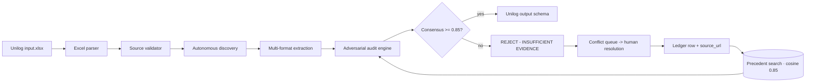

<div align="center">

# SEMI — Self-Evolving Manufacturer Intelligence

**UniHack 2026 · AI-Powered Product Intelligence for Industrial Commerce**

Given a minimal Excel input `(manufacturer, part_number)`, SEMI autonomously **discovers** manufacturer sources, **extracts** multi-format evidence, **adversarially audits** every value, and emits schema-bound output — or refuses with `INSUFFICIENT_EVIDENCE` rather than guessing.

[](LICENSE)
[](https://github.com/VarshneysvAI/semi-workbench/actions)
[](#)
[](#)
[](#)
[](#)

</div>

---

## Why it exists

Industrial e-commerce transactions are polluted by scraped, unverified product
attributes. SEMI is a **human-gated, evidence-traced pipeline**: no value ships
without a source URL, a ranked source chain, and five adversarial audits with a
statistical coverage interval — and when evidence is thin, **it refuses to
guess**.

## How it works



_Autonomous discovery_
: targeted `site:` search, streaming the path; missing documents & marketplaces
  (Amazon / eBay / Target) are blockers. Source authority      1.0 spec ·
  0.9 manual · 0.7 page · 0.5 video.

_Adversarial audit (the headline — Core Innovation)_
: **5 checks per value** — physical constraint rules (e.g. `material=PVC ∧
  pressure>150psi`), cross-source contradiction, compositional physics curve,
  disproof search, **split conformal 95% CI** — `[lo, hi]` on every cell.

_Two-pass human-in-the-loop flywheel_
: a resolution writes a ledger row with `source_url`; the succeeding precedent
  match is a counterfactual demo: `changed_outcome=true` ticks the counter.

## Repository layout

```
.
├── backend/                 # FastAPI (Python 3.13)
│   ├── schemas/state_graph.py  # state graph + conflict models (Day 2)
│   ├── ingest/               # excel_input · source_validator · output_mapper
│   ├── discover/             # source ranking & query builder (Day 1 skeleton)
│   └── tests/                # pytest suite (5 passing)
├── dashboard/                # React 19 + Vite + Tailwind SPA
│   ├── src/engine/           # in-browser enrichment simulation engine
│   ├── src/views/            # Overview · Sheet · Discovery · Audit ·
│   │                         # Review queue · Evidence · Ledger
│   └── public/               # brand assets (logo, boot.mp4)
├── docs/
│   └── api_contract.md       # FastAPI <-> dashboard contract
├── TODO.md                   # running day-by-day checklist
└── UniHack_Final_Plan.md     # full feasibility plan
```

## Tech Stack

| Layer | Choice | Why |
|---|---|---|
| Frontend | React 19 · Vite 8 · Tailwind 3 · Framer Motion | fast dev loop; small bundle; spring-soft motion |
| Backend | FastAPI 0.141 · uvicorn | typed contract, WS-native, async-first |
| Extraction | Playwright · BeautifulSoup · Marker · EasyOCR (staged) | formats: pdf/web/nameplate/video |
| LLM fallback | **Gemma 4 12B** (local, 4-bit, temp 0.0) | single-field extraction only, never bulk |
| Embeddings | BGE-M3 (ledger contention, cosine ≥ 0.85) | multilingual, tied to retrieval threshold |

## Quickstart

### Backend

```bash
cd backend
python -m venv .venv && .venv\Scripts\activate        # Windows or `source .venv/bin/activate`
pip install -r requirements.txt                        # slim: fastapi uvicorn pandas openpyxl
uvicorn backend.server:app --reload --port 8000       # docs at /docs
```

### Dashboard

```bash
cd dashboard
npm install
npm run dev                    # http://localhost:5173  (proxies /api to :8000)
```

Run the tests:

```bash
backend\.venv\Scripts\python -m pytest backend\tests -q
```

## API (locked in `docs/api_contract.md`)

| Method | Endpoint | Purpose |
|---|---|---|
| `GET` | `/api/health` | liveness + version |
| `POST` | `/api/ingest` | upload Unilog workbook → parse → state graphs |
| `GET` | `/api/state_graph/{sku}` | provenance source chain + candidates |
| `GET` | `/api/conflicts/{sku}` | open conflict (NPT vs BSPT …) |
| `POST` | `/api/resolve` | human resolution → ledger row + `changed_outcome` |
| `WS` | `/ws/ledger_events` | live counterstream |
| `GET` | `/api/ab_compare/{sku}` · `/api/ontology/{mfr}` | finale surface |

## Roadmap (UniHack 2026 · 23 Aug)

| Day | Milestone | Status |
|---|---|---|
| 0 | Scaffold · API contract · design system | ✅ |
| — | Dashboard — 7 console views, sim engine, boot animation | ✅ |
| 1 | Cross-manufacturer GATE (corpus study) | ⏳ awaits official dataset (±Aug 11) |
| 2 | State graph store · ingest pipeline · resolver + WS | ✅ backend, tests green |
| 3 | Unilog schema mapping (`output_mapper.py` prepped, `DAY3` markers) | ✅ prep |
| 4–5 | Autonomous discovery + multi-format extraction (Playwright, OCR) | ⬜ |
| 6–7 | Adversarial audit engine · conformal calibration · refusal gate | ⬜ |
| 8 | Two-pass live-learning demo (counterfactual flip) | ⬜ |
| 9–10 | Seeded ledger + classifier overlay · Unilog schema wiring | ⬜ |
| 12+ | Deploy · docs · demo video · submission | ⬜ |

Follow the live progress in **`TODO.md`** (with Work Log).

## Honesty notes

- Cost figures in the deck are **structural estimates**, not audited financials.
- Classifier accuracy is reported as a **cross-validated** score.
- "System builds its own training data" ships with a footnote disclaimer.

## License

MIT © 2026 VarshneysvAI — see [LICENSE](LICENSE).