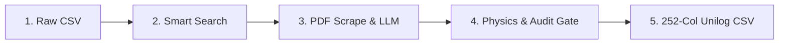

<p align="center">
  
</p>

<h1 align="center">SEMI — Industrial Intelligence Platform</h1>

<p align="center">
  <strong>Autonomous Product Data Extraction, Hallucination Prevention & 252-Column Unilog Normalization</strong>
</p>

<p align="center">
  
  
  
  
  
  
</p>

---

## 💡 What is SEMI?

In B2B industrial sales, distributors receive raw catalog spreadsheets containing only basic **Manufacturer Names** and **Part Numbers**. Over 70% of technical attributes—such as operating voltages, dimensions, pressure limits, and compliance standards—are missing.

**SEMI** solves this problem autonomously. Given just a Part Number and Manufacturer, SEMI scours official spec sheets, extracts complete product attributes using LLMs, verifies data against physics constraints to eliminate AI hallucinations, and outputs a B2B-compliant **252-column Unilog delivery CSV**.

---

## ⚡ How It Works (5-Step Pipeline)



1. **Ingestion**: Accepts messy CSV files with minimal headers (`Mfg_Part_Num`, `Part_Manuf`).
2. **Smart Search**: Finds authoritative manufacturer PDF spec sheets while skipping junk consumer sites.
3. **LLM Extraction**: Uses NVIDIA NIM / Gemini 2.5 to extract 40+ dynamic attributes and exact text evidence.
4. **Adversarial Audit Engine**: Checks physical boundaries, unit consistency, and flags contradictions. If AI confidence is low, SEMI marks the row `NEEDS_REVIEW` instead of guessing.
5. **Standardized Export**: Exports ready-to-use 252-column Unilog B2B delivery spreadsheets and lineage audit trails.

---

## 🖥️ Platform Modules

* **Overview & Ingestion**: Drag-and-drop CSV upload, batch size controls, real-time worker telemetry.
* **Dynamic Inspector Drawer**: Click any row to view extracted attributes, confidence intervals ($[0.85 - 0.99]$), and direct spec sheet links.
* **Review Queue (`/conflicts`)**: Interactive human-in-the-loop review to resolve brand or spec contradictions with one-click adoption (`Adopt A/B`).
* **Source Funnel (`/discovery`)**: Displays candidate URLs, domain authority rankings, and anti-bot trigger logs.
* **Audit Ledger (`/evidence`)**: Line-by-line provenance audit database with exact citations.
* **Run History (`/history`)**: Persisted execution history with download links for Delivery CSV, Lineage CSV, and Status Reports.

---

## 📊 The 252-Column Unilog Delivery Format

SEMI formats extracted attributes directly into the standard B2B e-commerce schema:

| Field Group | Example Columns | Field Count |
| :--- | :--- | :--- |
| **Product Identifiers** | `PART_NUMBER`, `Mfg_Part_Num`, `SKU - MY_PART_NUMBER` | 12 |
| **Manufacturer & Brand** | `MANUFACTURER_NAME`, `BRAND_NAME`, `E1_Brand` | 7 |
| **Descriptions** | `SHORT_DESC`, `LONG_DESC1`, `MARKETING_DESCRIPTION` | 8 |
| **Bullet Features** | `ITEM_FEATURES_1` through `ITEM_FEATURES_20` | 20 |
| **Dynamic Attributes** | `ATTRIBUTE_LABEL 1..50`, `ATTRIBUTE_VALUE 1..50`, `ATTRIBUTE_UOM 1..50` | 150 |
| **Physical Dimensions** | `LENGTH`, `HEIGHT`, `WIDTH`, `WEIGHT`, `VOLUME` (+ UOMs) | 10 |
| **Media Links** | `Product Image`, `Specification Sheet`, `Catalog`, `SDS` | 25 |

---

## 🚀 Getting Started

### Prerequisites
* **Python**: 3.11 or higher
* **Node.js**: 18.0 or higher

### Environment Setup
Create a `.env` file inside `backend/`:
```ini
PRIMARY_PROVIDER=nim
FALLBACK_PROVIDERS=gemini
LLM_API_KEY_NIM=your_nvidia_nim_key
GOOGLE_API_KEY=your_gemini_key
CONCURRENCY=3
CACHE_ENABLED=true
MAX_ROWS_PER_RUN=200
```

### Installation & Run

```bash
# Clone the repository
git clone https://github.com/VarshneysvAI/semi-workbench.git
cd semi-workbench

# Setup Python environment
python -m venv .venv
source .venv/bin/activate  # On Windows: .venv\Scripts\activate
pip install -r backend/requirements.txt

# Build Dashboard UI
cd dashboard
npm install
npm run build
cd ..

# Launch unified platform
python -m uvicorn backend.live_app:app --host 127.0.0.1 --port 8000
```
Open **`http://127.0.0.1:8000`** in your web browser.

---

## 🤖 Headless CLI Execution

Run batch jobs directly from terminal:
```bash
python -m backend.cli --input tests/data/mvp_5_rows.csv --output output_mvp_demo --max-rows 5
```

Generated Output Files:
* `Unihack_Delivery_Format_Output.csv`: 252-column Unilog delivery file.
* `lineage.csv`: Field-level evidence snippets and confidence scores.
* `status_report.csv`: Status disposition (`SUCCESS`, `CACHED`, `NEEDS_REVIEW`).

---

## 🌐 Deployment Options

### Single-Server Deployment (Render / Railway / AWS)
FastAPI serves the static frontend directly from `dashboard/dist`:
* **Build Command**: `cd dashboard && npm install && npm run build && cd .. && pip install -r backend/requirements.txt`
* **Start Command**: `python -m uvicorn backend.live_app:app --host 0.0.0.0 --port $PORT`

### Decoupled Deployment
* **Frontend**: Deploy `dashboard/` to Vercel/Netlify with output directory `dist`.
* **Backend**: Deploy `backend/` to Render/Railway as a FastAPI web service.

---

## 🏆 Credits

Developed by **Team VarshneysvAI** for UniHack 2026.
*Track: AI-Powered Product Intelligence for Industrial Commerce*
