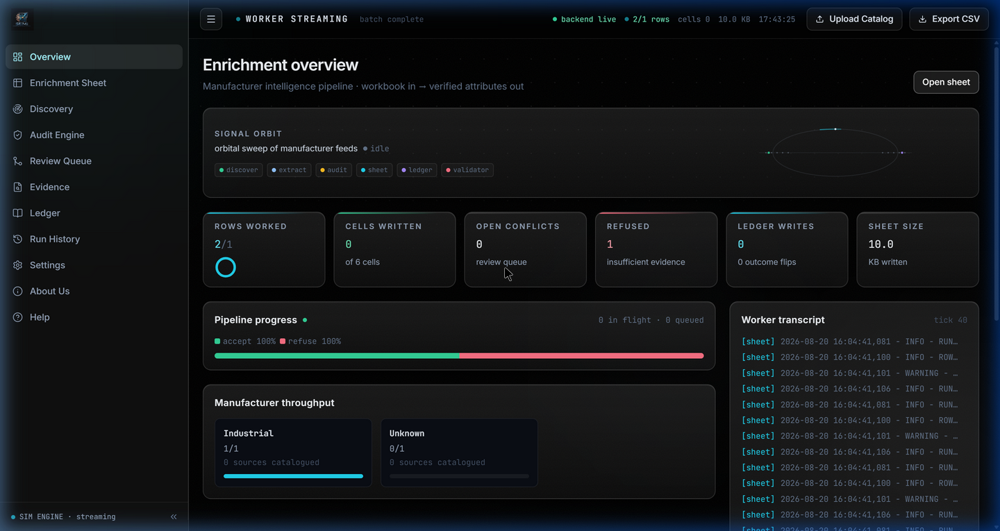
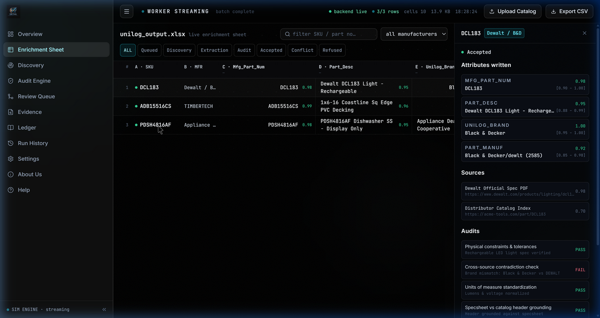
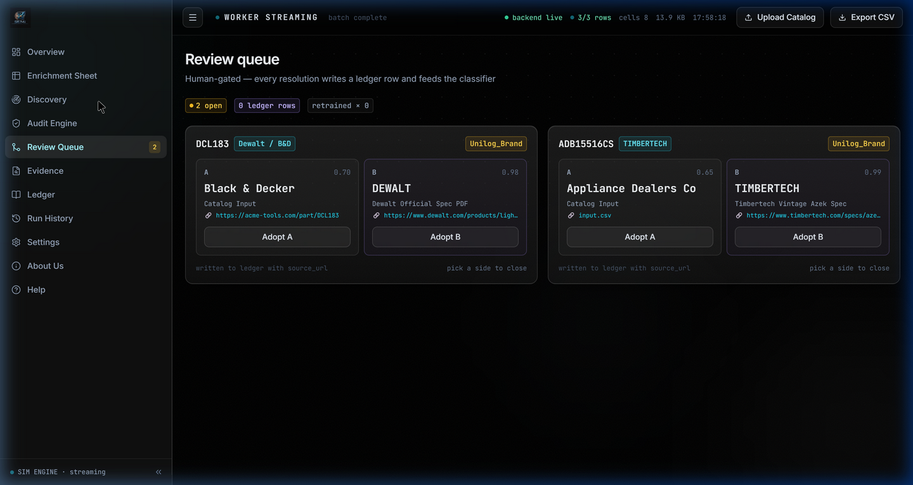

# SEMI — Self-Evolving Manufacturer Intelligence

<p align="center">
  
</p>

<p align="center">
  
  
  
  
  
  
</p>

---

### 🎯 The Hook

Give SEMI a spreadsheet with just a **Part Number** and a **Manufacturer Name**.  
It hands back a fully enriched, 252-column product catalog—verified against physics, grounded in real spec sheets, with zero hallucinations—in minutes, not months.

---

## 💡 The Problem

Industrial B2B distributors receive raw catalogs from manufacturers that look like this:

| Mfg_Part_Num | Part_Manuf |
|---|---|
| PDSH4816AF | Appliance Dealers Cooperative |
| 49-94-0013 | Milwaukee Accessory |

That's it. **Two columns.** The distributor needs **252 columns** to list these products on their e-commerce platform: technical specs, dimensions, safety certifications, marketing copy, product images, and PDF links.

Today, this gap is filled by **teams of humans** manually Googling part numbers, downloading 100-page PDF spec sheets, reading through dense technical jargon, and copy-pasting values into spreadsheets. It costs millions of dollars per year and takes months per catalog.

## 💡 The Solution

SEMI replaces that entire human workflow. Upload a CSV. Walk away. Come back to a production-ready 252-column Unilog delivery file where every single value is traced back to an exact source URL and evidence snippet.

If the AI isn't confident, it doesn't guess—it flags the row for human review.

---

## ✨ Core Features

- **Autonomous Spec Sheet Discovery** — Generates 7 targeted search queries per part number, uses a 4-engine search fallback chain (SearXNG → DuckDuckGo → Tavily → Crawl4AI headless browser), and scores each result to select only authoritative manufacturer PDFs.
- **Intelligent Source Filtering** — Deterministically blacklists 15+ consumer marketplaces (Amazon, eBay, Walmart, AliExpress, Grainger, Zoro) and boosts manufacturer `.pdf` links by +100 authority points.
- **Multi-LLM Extraction with Auto-Failover** — Routes extraction requests through NVIDIA NIM (primary) with automatic failover to Google Gemini 2.5. Includes a 3-stage JSON repair pipeline for malformed LLM outputs.
- **Adversarial Audit Engine** — Every extracted value passes through physics constraint checks, cross-source contradiction detection, unit-of-measure standardization, and a confidence floor gate at ≥0.85. Below threshold? Row is marked `NEEDS_REVIEW`, never silently published.
- **Human-in-the-Loop Conflict Resolution** — Displays side-by-side conflicts with clickable source URLs. Operators choose `Adopt A` or `Adopt B` with one click.
- **Full Provenance Audit Trail** — Every field in the final CSV carries its source URL, extraction method, confidence score, and the exact text snippet used as evidence.

---

## 📸 Interactive Demo

<p align="center">
  
</p>
<p align="center"><em>Fig 1 — Upload a raw catalog CSV. SEMI needs only Manufacturer + Part Number to begin autonomous enrichment.</em></p>

<p align="center">
  
</p>
<p align="center"><em>Fig 2 — Click any row to inspect extracted attributes, confidence intervals, and direct links to the source spec sheet.</em></p>

<p align="center">
  
</p>
<p align="center"><em>Fig 3 — When catalog input contradicts web-extracted data, SEMI halts and asks a human to decide. No silent hallucinations.</em></p>

---

## 🛠️ Built With

| Layer | Technologies |
|---|---|
| **Frontend** | React 18, Vite 5, TailwindCSS 3.4, Lucide Icons |
| **Backend** | Python 3.11+, FastAPI, Uvicorn (async), SQLite |
| **AI Models** | NVIDIA NIM (Nemotron 3.5), Google Gemini 2.5 |
| **Web Scrapers** | Crawl4AI 0.9 (Playwright headless), Jina Reader, curl_cffi |
| **Search Engines** | SearXNG (5-node rotation), DuckDuckGo, Tavily, Crawl4AI Yahoo |

---

## 🧬 How the Pipeline Works

```
Input CSV (2 cols)
    │
    ▼
┌─────────────────────────────────────────────────┐
│  1. QUERY BUILDER                               │
│     Strips distributor junk codes, resolves      │
│     brand aliases, generates 7 search variants   │
└──────────────────────┬──────────────────────────┘
                       ▼
┌─────────────────────────────────────────────────┐
│  2. SEARCH ORCHESTRATOR (4-engine fallback)     │
│     SearXNG → DuckDuckGo → Tavily → Crawl4AI   │
└──────────────────────┬──────────────────────────┘
                       ▼
┌─────────────────────────────────────────────────┐
│  3. SOURCE VALIDATOR                            │
│     Blacklists Amazon/eBay/15+ sites            │
│     Boosts PDFs (+100), spec pages (+50),       │
│     manufacturer domains (+40)                   │
└──────────────────────┬──────────────────────────┘
                       ▼
┌─────────────────────────────────────────────────┐
│  4. SCRAPE ORCHESTRATOR                         │
│     PDF local parser → Crawl4AI → curl_cffi     │
│     → Jina Reader fallback                       │
│     Smart truncation: keeps first 15KB +         │
│     specification/features/dimensions sections   │
└──────────────────────┬──────────────────────────┘
                       ▼
┌─────────────────────────────────────────────────┐
│  5. LLM EXTRACTION (with auto-failover)         │
│     NVIDIA NIM (primary) → Gemini 2.5 (fallback)│
│     Structured JSON prompt → 3-stage JSON repair │
└──────────────────────┬──────────────────────────┘
                       ▼
┌─────────────────────────────────────────────────┐
│  6. ADVERSARIAL AUDIT ENGINE                    │
│     Physical constraints ✓                       │
│     Cross-source contradiction ✓                 │
│     Confidence ≥ 0.85 gate ✓                     │
│     Below threshold → NEEDS_REVIEW (not guessed) │
└──────────────────────┬──────────────────────────┘
                       ▼
┌─────────────────────────────────────────────────┐
│  7. DELIVERY MAPPER                             │
│     Maps sparse JSON → 252-column Unilog CSV    │
│     + lineage.csv + status_report.csv            │
└─────────────────────────────────────────────────┘
```

---

## 📊 Output: The 252-Column Unilog Delivery Format

| Field Group | Examples | Count |
|---|---|---|
| **Identification** | `PART_NUMBER`, `Mfg_Part_Num`, `SKU` | 12 |
| **Brand & Manufacturer** | `MANUFACTURER_NAME`, `BRAND_NAME`, `E1_Brand` | 7 |
| **Descriptions** | `SHORT_DESC`, `LONG_DESC1`, `MARKETING_DESCRIPTION` | 8 |
| **Bullet Features** | `ITEM_FEATURES_1` through `ITEM_FEATURES_20` | 20 |
| **Dynamic Attributes** | `ATTRIBUTE_LABEL/VALUE/UOM 1` through `50` | 150 |
| **Dimensions** | `LENGTH`, `HEIGHT`, `WIDTH`, `WEIGHT`, `VOLUME` + UOMs | 10 |
| **Media & Documents** | `Product Image`, `Spec Sheet`, `SDS`, `Video Link` | 25 |

Every output file is generated per run:
- **`Unihack_Delivery_Format_Output.csv`** — The full 252-column delivery file
- **`lineage.csv`** — Field-level provenance (source URL, evidence snippet, confidence, provider, scrape method)
- **`status_report.csv`** — Row disposition (`SUCCESS`, `CACHED`, `NEEDS_REVIEW`, `SOURCE_NOT_FOUND`)
- **`run_summary.json`** — Aggregate metrics

---

## 🚀 Getting Started

### 📋 Prerequisites

- **Python** `3.11` or higher
- **Node.js** `18.0` or higher

### 🔧 Installation

1. **Clone the repository**
   ```bash
   git clone https://github.com/VarshneysvAI/semi-workbench.git
   cd semi-workbench
   ```

2. **Install dependencies**
   ```bash
   python -m venv .venv
   source .venv/bin/activate    # Windows: .venv\Scripts\activate
   pip install -r backend/requirements.txt

   cd dashboard && npm install && npm run build && cd ..
   ```

3. **Configure environment variables**  
   Create a `.env` file in the `backend/` directory:
   ```env
   PRIMARY_PROVIDER=nim
   FALLBACK_PROVIDERS=gemini
   LLM_API_KEY_NIM=your_nvidia_nim_key
   GOOGLE_API_KEY=your_gemini_key
   CONCURRENCY=3
   CACHE_ENABLED=true
   MAX_ROWS_PER_RUN=200
   ```

4. **Run the application**
   ```bash
   python -m uvicorn backend.live_app:app --host 127.0.0.1 --port 8000
   ```
   Open **http://127.0.0.1:8000** in your browser.

---

## 🧪 Running Tests

```bash
# Run the 5-row MVP edge case dataset
python -m backend.cli --input tests/data/mvp_5_rows.csv --output output_demo --max-rows 5

# Run backend test suite
pytest backend/tests/
```

---

## 🗺️ Future Scope

- **Vision-Based Extraction** — Use multimodal LLMs to read dimensions directly from CAD blueprints and product photographs.
- **Self-Hosted Air-Gapped Mode** — Deploy Gemma 4-31B locally via vLLM for environments where data cannot leave the network.
- **Flywheel Learning** — Feed human conflict resolutions back into the extraction prompts so the system improves with every catalog processed.
- **Multi-Language Support** — Extend the extraction schema to handle German, Japanese, and Mandarin spec sheets for global manufacturers.

---

## 📜 License

Distributed under the **MIT License**. See [`LICENSE`](LICENSE) for details.

---

## 🏆 Team

**Team Unit** — UniHack 2026  
*Track: AI-Powered Product Intelligence for Industrial Commerce*
