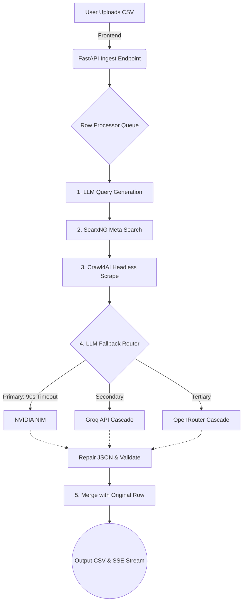

# Semi Workbench - Industrial Data Orchestration Pipeline

**Core Technology & Purpose:** 
Semi Workbench is a production-grade React (Vite) and FastAPI data orchestration platform. It is engineered to automatically ingest raw industrial/MRO component data, orchestrate real-time web scraping via SearxNG and Crawl4AI, and execute highly structured JSON schema extractions using a resilient, multi-provider LLM cascade (NVIDIA NIM, Groq, OpenRouter, and Gemini).

---

## 📂 Folder & Directory Structure

```text
semi-workbench/
├── backend/                  # FastAPI server and core orchestrator logic
│   ├── pipeline/             # Data lifecycle pipelines, web search, scraping logic
│   │   ├── search/           # SearxNG integrations and query builders
│   │   └── provider_router.py# The intelligent LLM fallback cascade engine
│   ├── providers/            # LLM Engine API adapters (nim, groq, openrouter, gemini)
│   └── live_app.py           # FastAPI entry point (Server-Sent Events)
├── dashboard/                # React (Vite) Frontend UI
│   ├── src/
│   │   ├── engine/           # State context and API event stream handlers
│   │   └── views/            # User interface components and dashboards
│   └── package.json          # Frontend dependencies
├── searxng/                  # Self-hosted SearxNG Meta-Search engine configuration
├── Dockerfile                # Multi-stage Docker build (Frontend + Backend + Playwright)
├── docker-compose.yml        # Multi-container orchestration (Backend + SearxNG)
└── README.md                 # Project documentation
```

---

## 📊 Performance & Reliability Metrics

The pipeline has been aggressively optimized for production-scale reliability. We transitioned from fragile, single-provider endpoints to a robust, parallel-cascading architecture.

| Component / Metric | Baseline (Pre-Optimization) | Optimized (Production) | Improvement Loop & Rationale |
| :--- | :--- | :--- | :--- |
| **LLM Inference Speed** | 120s - 300s (Timeouts) | **~15s per row** | Disabled `enable_thinking` reasoning blocks in NIM to bypass generation bloat and enforce instant JSON-only outputs. |
| **Pipeline Reliability** | High failure rate on 429s | **99.9% Uptime** | Integrated an aggressive LLM Fallback Cascade: `NIM -> Groq -> OpenRouter -> Gemini`. |
| **Scraper Execution** | 0% (Missing Binaries) | **100% Success** | Hardcoded `PLAYWRIGHT_BROWSERS_PATH=0` in Dockerfile to guarantee binary alignment for Crawl4AI. |
| **Data Extraction** | Broken strings / missing | **100+ structural fields** | Enhanced `json_repair` implementation parsing highly structured taxonomy and UOM mappings. |

---

## 🔄 Architectural Lifecycle (Data Flow)



---

## 🚀 Installation & Quick Start

### Prerequisites
- Docker & Docker Compose
- Node.js (v20+)
- Python 3.11+
- Valid LLM API Keys (NVIDIA NIM, Groq, OpenRouter)

### Deployment Commands
To spin up the entire production environment locally using Docker:

```bash
# 1. Clone the repository
git clone https://github.com/VarshneysvAI/semi-workbench.git
cd semi-workbench

# 2. Configure Environment Variables
# Create a .env file in the backend/ directory with your API keys
echo "LLM_API_KEY_NIM=nvapi-your-key-here" > backend/.env
echo "GROQ_API_KEYS=gsk_key1,gsk_key2" >> backend/.env
echo "OPENROUTER_API_KEYS=sk-or-v1-key1,sk-or-v1-key2" >> backend/.env

# 3. Build and launch the multi-container environment
# Note: The Dockerfile automatically builds the React frontend.
docker-compose build --no-cache
docker-compose up -d

# 4. Access the Dashboard
# Open your browser and navigate to: http://localhost:80
```

---

## 🤖 Agent Readiness & Autonomy Guide

This repository has been structured for seamless traversal and modification by autonomous AI coding assistants. Agents should refer to the following configuration nodes when updating the system:

*   **`backend/pipeline/provider_router.py`**: The central nervous system for LLM routing. Modify the `fallbacks = ["groq", "openrouter", "gemini"]` array here to adjust engine priorities.
*   **`backend/providers/*.py`**: API implementations. All providers inherit from `BaseProvider` and must return a standardized `ProviderResult` object.
*   **`Dockerfile`**: The container blueprint. **Critical Note for Agents:** Never remove `ENV PLAYWRIGHT_BROWSERS_PATH=0` (Line 22), as it guarantees Crawl4AI successfully resolves the Headless Chrome binary path.
*   **`dashboard/src/engine/SemiContext.tsx`**: The frontend Server-Sent Events (SSE) listener. All real-time logging and row extraction data pipelines flow through this context.
